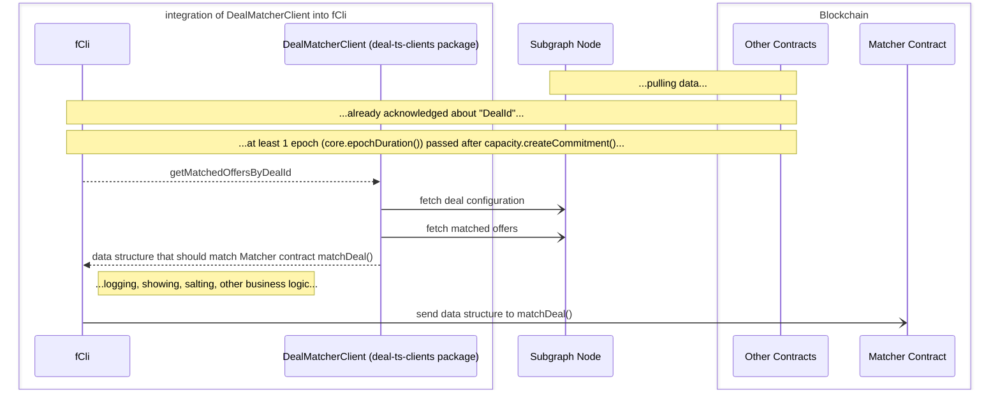

# ts-clients

Module consists of several TS clients to access Deal contract logic for different purposes: deal matching, contract address resolving, Network Explorer API, etc.  

<!-- START doctoc generated TOC please keep comment here to allow auto update -->
<!-- DON'T EDIT THIS SECTION, INSTEAD RE-RUN doctoc TO UPDATE -->

- [Requirements](#requirements)
- [Logging](#logging)
- [client](#client)
- [deal-cli-client](#deal-cli-client)
  - [Contribute](#contribute)
- [deal-mather-client](#deal-mather-client)
  - [Context Diagram](#context-diagram)
  - [Example Local Package Use](#example-local-package-use)
- [deal-explorer-client](#deal-explorer-client)
  - [Install](#install)
  - [Example UseCase](#example-usecase)
- [Develop](#develop)
  - [GraphQL Scheme Generation](#graphql-scheme-generation)
- [ToDo](#todo)

<!-- END doctoc generated TOC please keep comment here to allow auto update -->

# Requirements
- node version: v18.16.1

# Logging
Now all clients migrate from **console** to [debug](https://www.npmjs.com/package/debug) lib for logging. To control logging with this library check the doc: https://www.npmjs.com/package/debug#usage

# client
To load contract deployments and interfaces for different stands: kras/testnet/stage/etc.

> TODO: rename, because client says nothing.

# deal-cli-client
To resolve needs from POV of Fluence CLI. 

Example use - check via [deal-mather-client](#deal-mather-client).

## Contribute
Under the hood it uses indexer client [src/dealCliClient/indexerClient/indexerClient.ts](src/dealCliClient/indexerClient/indexerClient.ts) to fetch data from the indexer (subgraph). Because the indexer client uses TS, first of all you need to prepare your query as it is in [src/dealCliClient/indexerClient/queries](src/dealCliClient/indexerClient/queries) and then run codegen: `npm run codegen:dealCliClient` (be sure that [codegen script](codegen-deal-cli-indexer.ts) aims to the working subgraph).
After, you could fetch your queries in typised manner.

# deal-mather-client
To find preferable compute units for the deal and its configuration via Subgraph (indexer). The main user of the client is https://github.com/fluencelabs/cli (fCli).

## Context Diagram



## Example Local Package Use
From here I suppose you want to develop locally with this package. Thus, you need to prepare all package dependencies to run locally.

Thus, we suppose you use:
- local network
- node version v18.16.1 (example below is checked with this version)
- TS with installed package TODO: name. 

Check completed instruction on how to boot local deal infra: [#Develop with Deal Infrastructure](../README.md#Develop-with-Deal-Infrastructure)

main.js (to run with e.g. via `node --loader ts-node/esm main.ts`) with random dealId:
```typescript
import { DealMatcherClient } from "@fluencelabs/deal-aurora";

type asyncRuntimeDecoratorType = (func: Function) => void;

const asyncRuntimeDecorator: asyncRuntimeDecoratorType = (func) => {
    func()
        .then(() => process.exit(0))
        .catch((error: unknown) => {
            console.error(error);
            process.exit(1);
        });
};

async function main() {
    const stand = "local"
    // TODO: place your dealID below.
    const dealId = "0x00...0"

    // General typed class to use.
    const client = new DealMatcherClient(
        stand,
    );

    console.log(await client.getMatchedOffersByDealId(dealId))
}

asyncRuntimeDecorator(main);
```

# Develop
## GraphQL Scheme Generation
It generates typescripts for the graphQl schemes declared in [src/dealExplorerClient/indexerClient/queries](src/dealExplorerClient/indexerClient/queries) via fetched graphql schemes. Instruction rules are defined in [codegen-deal-explorer-indexer.ts](codegen-deal-explorer-indexer.ts).

Thus, TS files with `generated` key word you **should not rewrite manually**.

> Those generated files are under git commit because it is a part of the source code, e.g. 
> [dealExplorerClient.ts](client/dealExplorerClient/dealIndexerClient.ts) & [indexerClient.ts](client/dealExplorerClient/indexerClient/indexerClient.ts).

# ToDo
- [x] rename to deal-explorer-client
- [ ] use deal package instead of import from `../src`
- [ ] commit to the special repo
- [ ] after merge with foundry -> to different npm packages [refactor work with several packages]
- [x] add ulr links to fetch filters...
- [x] TODO: search fields: by client or dealId?
- [ ] resolve registered workers! (separate class?)
- [ ] page counter (thanks to graphQL for no paginators)?
- [x] optional filtering in `.graphql` schemes (discord solution processing...) [currently unsolved]
- [x] convert values: timestamps, eths
- [x] move to simple client
- [ ] codegen - get url from env
