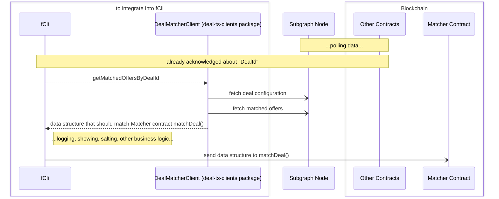

# ts-clients

* [deal-matcher-client](#deal-explorer-client)
   * [Context Diagram](#context-diagram)
* [deal-explorer-client](#deal-explorer-client)
   * [Install](#install)
   * [Example UseCase](#example-usecase)
* [Develop](#develop)
   * [GraphQL Scheme Generation](#graphql-scheme-generation)
* [ToDo](#todo)

## Requirements
- node version: v18.16.1

# client
To load contract deployments and interfaces for different stands: kras/testnet/stage/etc.

> TODO: rename, because client says nothing.

# deal-mather-client
To find preferable compute units for the deal and its configuration via Subgraph (indexer).

## Context Diagram



# deal-explorer-client
This client delivers data for the Explorer Frontend Application. The client consists of 3 ones:

- DealContractsClient - to load env {kras, testnet, stage} and deployed contracts
- DealRpcClient - with built-in multicall3 contract feature (1 JSON RPC request per several view calls on different Fluence contracts)
- IndexerClient - to fetch built GraphQL models from the indexer (i.e. The Graph/Subgraph)

## Install 
```bash
npm i @fluencelabs/deal-aurora
```

## Example UseCase
- node version v18.16.1
- TS

tsconfig.js for reactApp example:
```json
{
  "compilerOptions": {
    "lib": ["dom", "dom.iterable", "esnext"],
    "module": "esnext",
    "moduleResolution": "bundler",
    "target": "es2015",

    "allowJs": true,
    "allowSyntheticDefaultImports": true,
    "esModuleInterop": true,
    "forceConsistentCasingInFileNames": true,
    "isolatedModules": true,
    "jsx": "react-jsx",
    "noEmit": true,
    "noFallthroughCasesInSwitch": true,
    "resolveJsonModule": true,
    "skipLibCheck": true,
    "strict": true
  }
}
```

ready to use main.js (to run with e.g. via `node --loader ts-node/esm main.ts`)
```typescript
import { DealExplorerClient } from "@fluencelabs/deal-aurora";

type asyncRuntimeDecoratorType = (func: Function) => void;

const asyncRuntimeDecorator: asyncRuntimeDecoratorType = (func) => {
    func()
        .then(() => process.exit(0))
        .catch((error: unknown) => {
            console.error(error);
            process.exit(1);
        });
};

async function main() {
    // For local uncomment below:
    // const rpcUrl = "http://localhost:8545"
    // const stand = "local"

    // For Mumbai uncomment below:
    const rpcUrl = "https://rpc.ankr.com/polygon_mumbai"
    const stand = "testnet"

    // General typed class to use.
    const client = new DealExplorerClient(
        stand,
        rpcUrl,
        undefined,  // TODO: demonstrate on ready.
    );

    // With filter example.
    // await client.getProviders({ effectorIds: ["1241"] });

    // No filters example.
    const res = await client.getOffers();
    for (const offer of res.data) {
        console.log(offer.effectors)
    }
}

asyncRuntimeDecorator(main);
```

# Develop
## GraphQL Scheme Generation
It generates typescripts for the graphQl schemes declared in [src/indexerClient/queries](src/indexerClient/queries) via fetched graphql schemes. Instruction rules are defined in [codegen-deal-explorer-indexer.ts](codegen-deal-explorer-indexer.ts).

Thus, TS files with `generated` key word you **should not rewrite manually**.

> Those generated files are under git commit because it is a part of the source code, e.g. 
> [dealExplorerClient.ts](client/dealExplorerClient/dealIndexerClient.ts) & [indexerClient.ts](client/dealExplorerClient/indexerClient/indexerClient.ts).

# ToDo
- [x] rename to deal-explorer-client
- [ ] use deal package instead of import from `../src`
- [ ] commit to the special repo
- [ ] after merge with foundry -> to different npm packages [refactor work with several packages]
- [x] add ulr links to fetch filters...
- [x] TODO: search fields: by client or dealId?
- [ ] resolve registered workers! (separate class?)
- [ ] page counter (thanks to graphQL for no paginators)?
- [x] optional filtering in `.graphql` schemes (discord solution processing...) [currently unsolved]
- [ ] convert values: timestamps, eths
- [x] move to simple client
- [ ] codegen - get url from env
